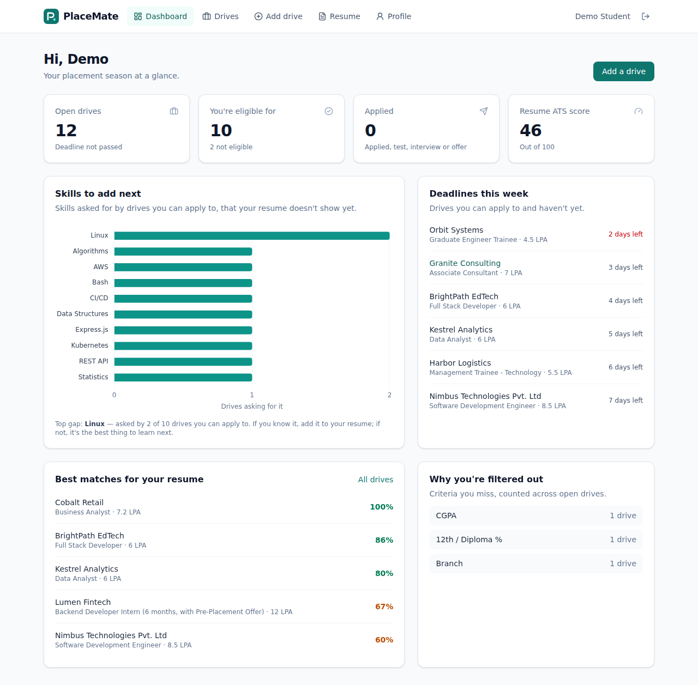
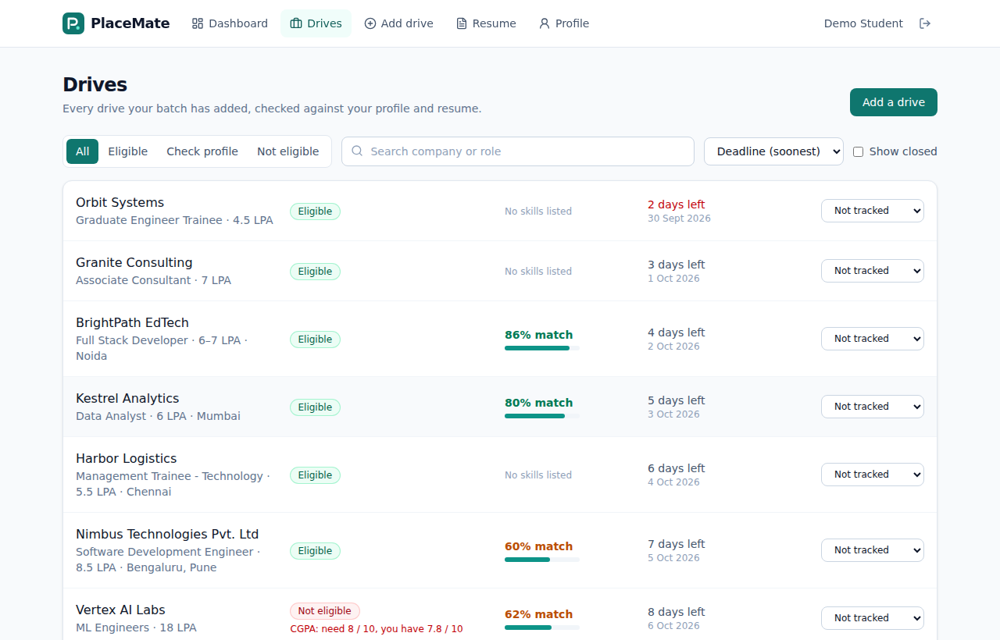
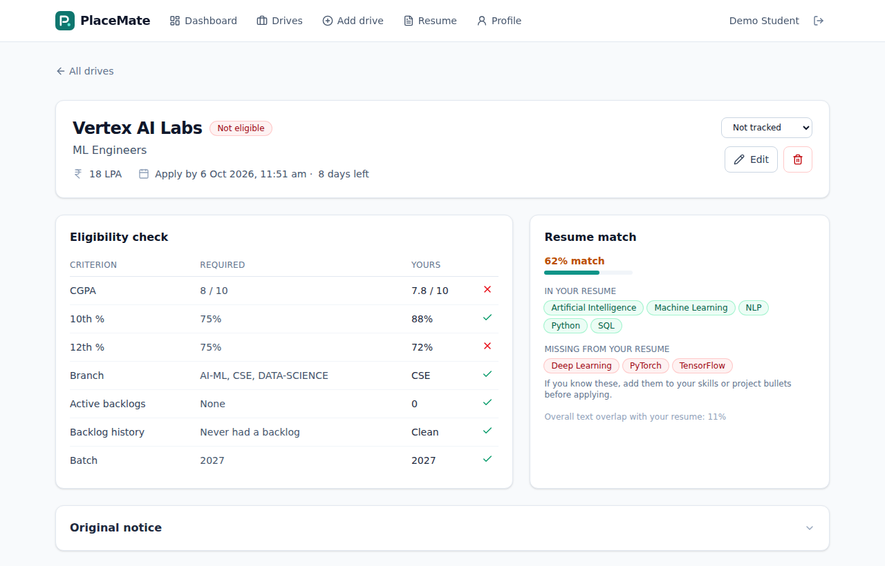
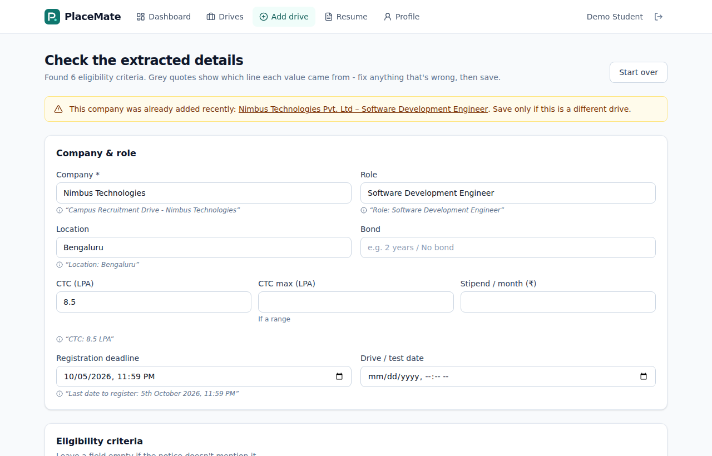
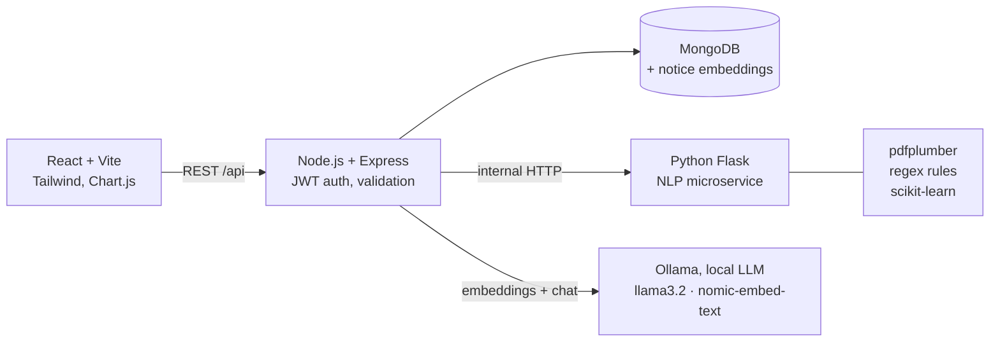
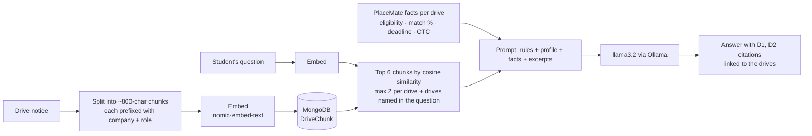

# PlaceMate: Campus Placement Assistant

During placement season, students get dozens of drive notices as PDFs, emails and WhatsApp forwards. Each one has its own eligibility rules ("CGPA ≥ 7, 60% in 10th & 12th, no active backlogs, CS/IT only"), and students either miss drives or waste time on ones they can't apply to.

**PlaceMate reads the notice for you.** Paste the text or upload the PDF and it:

1. **Extracts the eligibility criteria automatically:** CGPA (10- or 4-point scale), 10th/12th/diploma/graduation %, branches, backlog rules, batch, education gap, CTC, bond and deadlines. Each value shows the line it was read from, so you can check it before saving.
2. **Checks eligibility against your profile** and explains each result, for example *"12th %: need 75%, you have 72%"*.
3. **Scores your resume against each drive** and lists the skills the drive asks for that your resume doesn't show.
4. **Finds skill gaps across all drives:** *"Linux is asked for by 4 of the 10 drives you can apply to."* Existing resume checkers work on one job description at a time.
5. **Runs an ATS health check** on your resume: contact links, standard sections, bullets without metrics, weak verbs, length.
6. **Tracks deadlines and your application status** (applied → test → interview → offer).
7. **Ask PlaceMate (AI assistant, RAG):** ask questions in plain English, like *"Which drives close this week that I can apply to?"* or *"What's the bond at Orbit Systems?"*. Answers come only from the stored notices and your own eligibility, with clickable citations to each drive. It runs on a **local LLM (Ollama)**, so it costs nothing and no student data leaves the laptop.

Drives are shared. One student adds a notice and the whole batch sees it, each with their own eligibility and match score.



| Drives list | Drive detail |
|---|---|
|  |  |



---

## Architecture



| Part | Tech | Responsibility |
|---|---|---|
| `client/` | React 19, React Router, Tailwind CSS 4, Chart.js | UI, dashboard, forms |
| `server/` | Node.js, Express 5, Mongoose, JWT, bcrypt, Zod, Multer | Auth, data, eligibility logic, calls the NLP service |
| `nlp-service/` | Python, Flask, pdfplumber, scikit-learn | PDF text extraction, notice parsing, skill extraction, matching, ATS check |
| Database | MongoDB | Users, drives, applications, resume versions, notice chunks + embeddings |
| AI assistant | Ollama (local), `llama3.2:3b` + `nomic-embed-text` | Retrieval-Augmented Generation over the drive notices |

The NLP work runs in a separate Python service because Python has the better text and ML libraries. The browser never calls it directly: only the Node API does.

---

## How the key parts work

### 1. Reading a drive notice (`nlp-service/extractor.py`)

Rule-based extraction, one function per field. The difficult part is that every company writes criteria differently:

```
CGPA >= 7, 10th & 12th >= 60%
Minimum 65% in X and XII. Graduation: 6.5 CGPA and above
Class X: 70%, Class XII: 65%, CGPA 3.0/4 or equivalent
60% throughout academics (10th, 12th/Diploma and Graduation)
Minimum aggregate of 60% in 10th, 12th and graduation
```

For percentages, each line is turned into a sequence of **education-level mentions** (10th, 12th, diploma, graduation) and **percent values**. Two passes then pair them:

- **Tight pairs**: `Class X: 70%` puts a mention directly before its value.
- **Shared values**: `60% in 10th and 12th` and `10th & 12th >= 60%` apply one value to a group of mentions joined by *and*, *&*, *,* or */*.

Other rules handle CGPA scales (`3.0/4`, `out of 10`), branch aliases (EXTC = E&TC = ECE, "circuit branches", "CS/IT and allied"), backlog wording (active vs history, ATKT/KT, arrears), day-first Indian dates, and lakh-format salaries (`INR 7,00,000`).

Every extracted field keeps its **evidence** (the source line). The UI shows it under each field, so the student can confirm or correct the value before saving.

### 2. Eligibility (`server/src/utils/eligibility.js`)

Each criterion becomes a row: `{ label, required, yours, pass }`. `pass` is `true`, `false`, or `null` when the student hasn't filled in that part of their profile. An incomplete profile gives the status "Check profile" instead of a false rejection.

When the student's CGPA and the drive's cutoff use different scales (for example NMIMS 4-point vs a 10-point cutoff), the CGPA is converted linearly and the UI says the conversion is approximate.

### 3. Match score (`nlp-service/matcher.py`)

- **Skill extraction:** a taxonomy of ~120 skills with aliases (`ReactJS` → React, `ML` → Machine Learning). Short or ambiguous names are handled carefully:
  - "Go", "Express" and "Rust" are also English words, so they only count inside a list (`Java, Go, Rust`).
  - "C" and "R" must match case-sensitively.
- **Implied skills:** a resume that shows Spring Boot also gets Java, and Pandas gives Python.
- **Score = skill coverage:** the share of the drive's technical skills that the resume shows. Soft skills are listed but not scored.

> **Design decision.** Version 1 used *60% skill coverage + 40% TF-IDF cosine similarity*. When I measured it on the sample notices, cosine similarity was between 0.02 and 0.11 for **every** resume-notice pair. Notices are mostly eligibility boilerplate, so whole-text similarity carried almost no signal and just pulled every score down. It is now only a tie-breaker. IDF is also switched off for the pair comparison: with only two documents, IDF gives the *shared* words the lowest weight, which is the opposite of what's needed.

### 4. ATS health check (`nlp-service/resume.py`)

These are explainable rules, not a black box: contact details, including hyperlinks read from the PDF; standard section headings; bullet points rebuilt from PDF lines; the share of bullets containing a real number (years and names like `S3` don't count); action verbs; page count and length. Each issue lowers the score by a fixed amount (high −12, medium −6, low −3).

### 5. Ask PlaceMate: RAG over the drive notices (`server/src/services/rag.js`, `server/src/utils/rag.js`)



- **Indexing:** when a drive is added or edited, its notice is split into chunks, embedded, and stored in MongoDB (`DriveChunk`). If Ollama is off, the drive is still saved; `npm run reindex` catches up.
- **Retrieval:** the question is embedded and compared with every chunk by cosine similarity. At a campus scale of a few hundred chunks this takes milliseconds in Node, so no separate vector database is needed. At most 2 chunks per drive, so one long notice can't crowd out the others. If the question names a company, that company's notice is always included (a small keyword + vector hybrid).
- **Code for facts, AI for language.** A small model is unreliable at comparing "3.3/4 CGPA" with "7.0/10", so the LLM **never decides eligibility**. PlaceMate's own eligibility engine computes eligibility, match % and deadlines, and passes them to the model as a fact line per drive. The model's job is to find the relevant passages and explain them.
- **Grounding and citations:** the system prompt tells the model to answer only from the provided facts and excerpts, cite drives as `[D1]`, and say "I don't know" rather than guess. The UI turns citations into links to the drive, and lists the cited drives with the student's eligibility badge.
- **Why a local model:** it's free, it works offline, and resumes and marks never leave the machine. The model names are set in `.env`.

**Measuring it:** `npm run eval:rag` asks 15 questions about the sample drives (`server/eval/rag-questions.json`) and reports:
- **retrieval hit@6:** was the right drive's notice among the passages given to the model?
- **correct citation:** did the answer cite the right drive?

Add questions about your real drives to measure it on real data.

---

## Run it locally

You need **Node.js 20+**, **Python 3.10+** and **MongoDB** (local, or a free [MongoDB Atlas](https://www.mongodb.com/atlas) cluster).

```bash
# 1. NLP service  (terminal 1)
cd nlp-service
python -m venv .venv && source .venv/bin/activate      # Windows: .venv\Scripts\activate
pip install -r requirements.txt
python app.py                                           # http://localhost:5001

# 2. API  (terminal 2)
cd server
cp .env.example .env                                    # set MONGO_URI if not local
npm install
npm run seed                                            # optional: demo user + 12 sample drives
npm run dev                                             # http://localhost:5000
# On a Mac, if port 5000 is taken by AirPlay, set PORT=5050 in .env
# and start the client with: VITE_API_PROXY=http://localhost:5050 npm run dev

# 3. Frontend  (terminal 3)
cd client
npm install
npm run dev                                             # http://localhost:5173
```

Demo login after seeding: **demo@placemate.dev / demo12345**.

**Ask PlaceMate (one-time setup, Mac):**

```bash
brew install ollama
brew services start ollama          # runs Ollama in the background
ollama pull llama3.2:3b             # ~2 GB chat model, fine on 8 GB RAM
ollama pull nomic-embed-text        # ~270 MB embedding model
cd server && npm run reindex        # embed the drive notices
npm run eval:rag                    # optional: measure retrieval + citations
```

On a slower laptop, `qwen2.5:1.5b` also works: set `OLLAMA_CHAT_MODEL=qwen2.5:1.5b` in `server/.env`. The seed moves the sample deadlines forward so the demo drives never show as closed.

### Or with Docker

```bash
cp .env.example .env        # set JWT_SECRET
docker compose up --build   # http://localhost:8080
docker compose exec server npm run seed   # optional demo data
```

---

## Tests and evaluation

```bash
cd nlp-service && python -m pytest -q     # extraction, skills, matching, API
cd server && npm test                     # eligibility rules + RAG helpers (16 tests)
node server/tests/fake-ollama.js          # stand-in for Ollama, to try the assistant without models
cd nlp-service && python eval/evaluate.py -v
```

`eval/evaluate.py` compares the extractor's output with hand-written correct values (`eval/labels.json`) for every notice in `eval/notices/`, and prints field-level accuracy.

> The 12 sample notices were written while the rules were being built, so the score on them says the rules work, **not** how accurate they are on unseen notices. To get an honest number, add **30+ real notices** from your placement cell (remove any personal details), label them in `labels.json` *before* running the script, and report that result.

---

## API

All routes except auth need `Authorization: Bearer <token>`.

| Method | Route | Purpose |
|---|---|---|
| POST | `/api/auth/register`, `/api/auth/login` | Create account / log in (rate-limited) |
| GET | `/api/auth/me` | Current user |
| PUT | `/api/profile` | Update academic profile |
| POST | `/api/resume` | Upload resume PDF → skills + ATS report |
| GET | `/api/resume/history` | ATS score per upload |
| POST | `/api/drives/parse` | Extract fields from notice text or PDF (not saved) |
| POST | `/api/drives` | Save a reviewed drive |
| GET | `/api/drives?status=&sort=&q=` | Drives with your eligibility + match |
| GET / PUT / DELETE | `/api/drives/:id` | View / edit / delete (edit/delete: creator only) |
| PUT | `/api/drives/:id/application` | Set your status: applied, test, interview… |
| GET | `/api/insights` | Dashboard: skill gaps, deadlines, best matches |

---

## Deploying (free tiers)

1. **Database:** create a free MongoDB Atlas cluster and copy its connection string.
2. **NLP service:** on Render, create a *Web Service* with root `nlp-service`, build command `pip install -r requirements.txt` and start command `gunicorn -b 0.0.0.0:$PORT app:app`.
3. **API:** on Render, create a *Web Service* with root `server`, build `npm ci`, start `npm start`. Set the env vars from `.env.example`: `MONGO_URI`, a long random `JWT_SECRET`, `NLP_URL` (the Render URL from step 2), `CLIENT_ORIGIN` (your Vercel URL) and `NODE_ENV=production`.
4. **Frontend:** on Vercel, import the repo with root `client` and set `VITE_API_URL=https://<your-api>.onrender.com/api`.

Render's free services sleep when idle, so the first request after a while takes ~30 seconds.

---

## Project structure

```
placemate/
├── client/                 React frontend
│   └── src/
│       ├── pages/          Dashboard, Drives, AddDrive, DriveDetail, Resume, Profile, AuthPage
│       ├── components/     DriveForm, Charts, Layout, ui
│       └── lib/            api client, auth context, formatting
├── server/                 Express API
│   ├── src/
│   │   ├── models/         User, Drive, Application, ResumeVersion
│   │   ├── routes/         auth, profile, resume, drives, insights
│   │   ├── services/       NLP client, per-student drive view
│   │   └── utils/          eligibility rules
│   ├── scripts/seed.js
│   └── tests/
├── nlp-service/            Flask NLP microservice
│   ├── extractor.py        notice → eligibility criteria
│   ├── matcher.py          skills + matching
│   ├── resume.py           PDF parsing + ATS check
│   ├── skills.py           skill taxonomy
│   ├── eval/               sample notices, labels, accuracy script
│   └── tests/
└── docker-compose.yml
```

## Roadmap

- [ ] LLM fallback for notices the rules can't read, and a rules-vs-LLM accuracy comparison on the same labelled set
- [ ] Sentence-BERT embeddings on the job-description part of the notice
- [ ] Email / Telegram reminders 24 hours before a deadline
- [ ] Placement-cell admin role that verifies drives
- [ ] Read notices straight from a Gmail label
